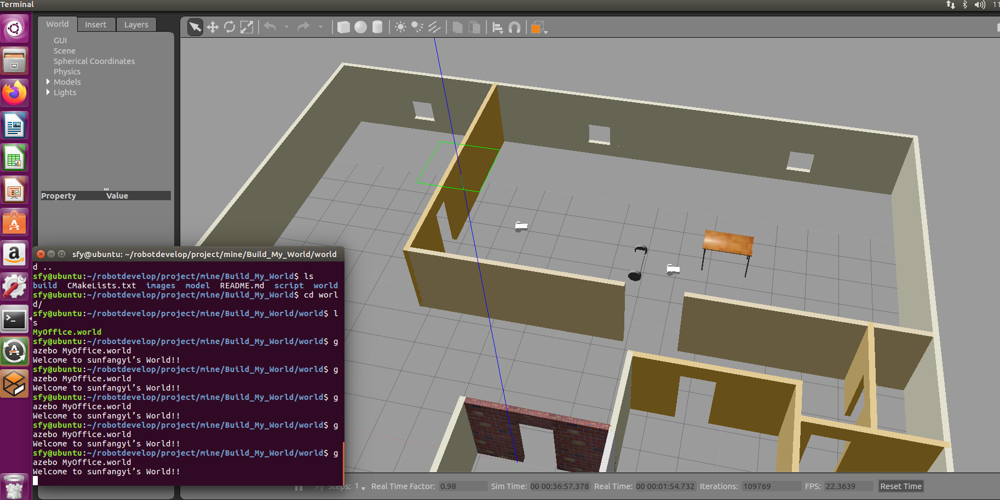

# Build_My_World
This is the code for my Udacity Robotics Software Engineer Nanodegree  - Build My World. It creates a simulation world with Gazebo.

### Directory Structure
```
    .Build_My_World               # main folder 
    ├── images                         # Code output image
    │   ├── MyOffice.png
    ├── model                          # Model files of the two-wheeled robot
    │   ├── Building
    │   │   ├── model.config
    │   │   ├── model.sdf
    │   ├── MobileRobot
    │   │   ├── model.config
    │   │   ├── model.sdf
    │   │   ├── myMobileRobot
    │   │   │   ├── model.config
    │   │   │   ├── model.sdf
    ├── script                         # Gazebo World plugin C++ script
    │   ├── welcome_message.cpp
    ├── world                          # Gazebo main World containing models
    │   ├── MyOffice.world
    ├── CMakeLists.txt                 # Link libraries 
    └── README.md
```

### Steps to launch the simulation

#### Clone the project folder in /home/workspace/
```sh
$ cd /home/workspace/
$ git clone https://github.com/shamcondor/Build_My_World.git
```

#### Compile the code
```sh
$ cd /home/workspace/Build_My_World/
$ mkdir build
$ cd build/
$ cmake ../
$ make
```

#### Add the library path to the Gazebo plugin path  
```sh
$ export GAZEBO_PLUGIN_PATH=${GAZEBO_PLUGIN_PATH}:/home/workspace/Build_My_World/build
```

#### Run the Gazebo World file  
```sh
$ cd /home/workspace/Build_My_World/world/
$ gazebo MyOffice.world
```

### Output
A welcome message is printed and the Building, MobileRobots are displayed inside a Gazebo World. It should launch as follow:

